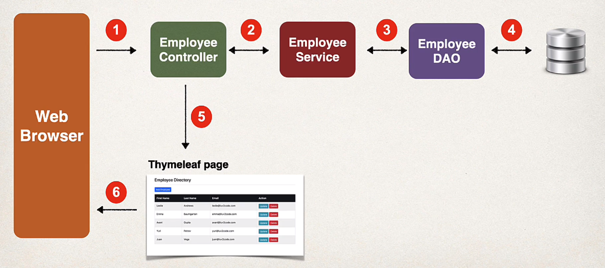
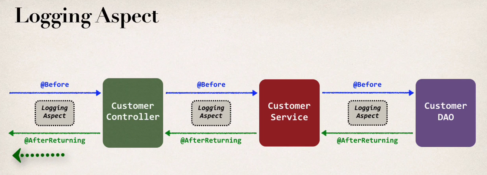
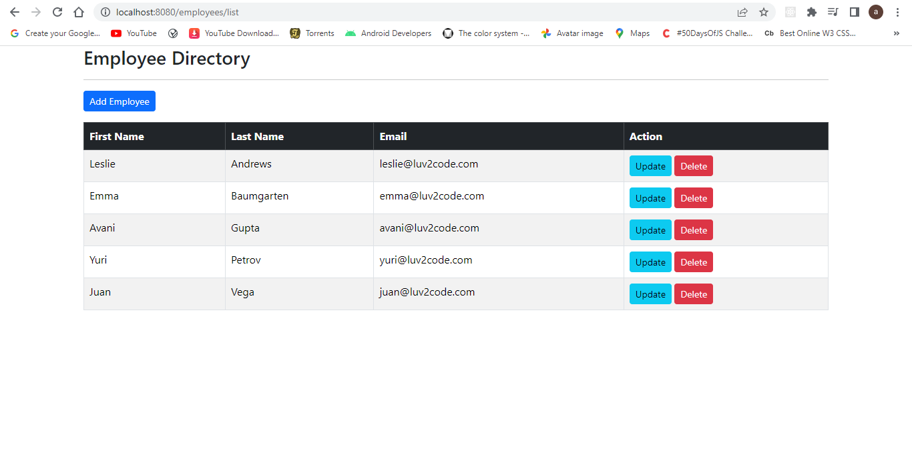
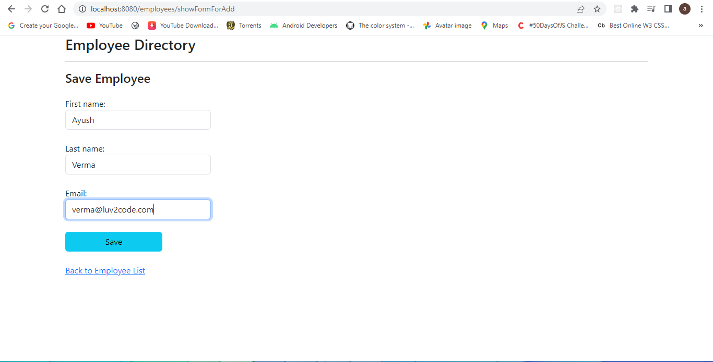
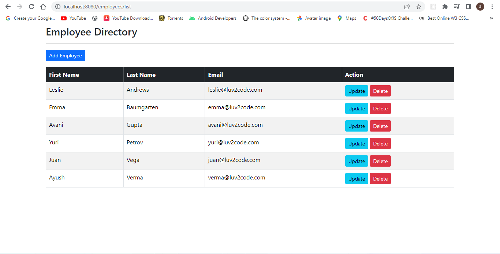

# Employee-Database-CRUD-project

 ## Table of Contents
- [Architecture](#architechure)
- [Logging Aspect](#logging)
- [Web app Screenshots](#ss)

## Architecture 

## Loging Aspect 

## Web App Screenshots

- Home Page

- Adding Employee

- Employee merge
